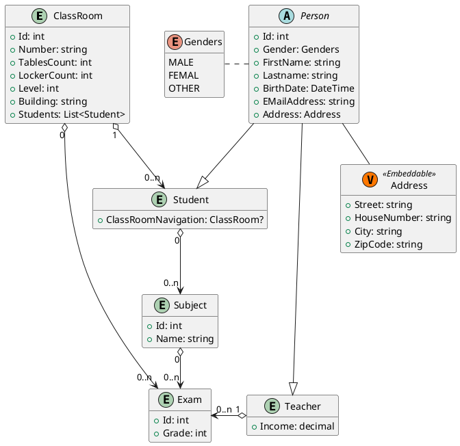

# SpengerAdmin

Vorklopfprojekt für die 3AHIF.

## Beschreibung

Lorem ipsum...

## Team

* Der Schrutek alleine

## Model

Modelliert mit PLANT-UML

```plantuml

@startuml

entity ClassRoom {
    + Id: int
    + Number: string
    + TablesCount: int
    + LockerCount: int
    + Level: int
    + Building: string
    + Students: List<Student>
}

abstract Person {
    + Id: int
    + Gender: Genders
    + FirstName: string
    + Lastname: string
    + BirthDate: DateTime
    + EMailAddress: string
    + Address: Address
}

entity Student {
    + ClassRoomNavigation: ClassRoom?
}

entity Teacher {
    + Income: decimal
}

entity Exam {
    + Id: int
    + Grade: int
}

entity Subject {
    + Id: int
    + Name: string
}

enum Genders {
    MALE
    FEMAL
    OTHER
}

class Address << (V,#FF7700) Embeddable >> {
    + Street: string
    + HouseNumber: string
    + City: string
    + ZipCode: string
}

ClassRoom "1" o--> "0..n" Student
Student "0" o--> "0..n" Subject
Subject "0" o--> "0..n" Exam
Teacher "1" o-left-> "0..n" Exam
ClassRoom "0" o--> "0..n" Exam

Genders .right. Person

Student <|-up- Person
Teacher <|-up- Person

Person -- Address

hide empty members

@enduml

```

